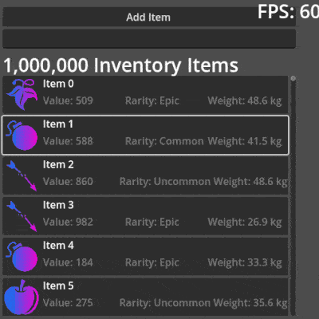

# LazyListBox for Godot 4.4+


> [!WARNING]  
> Ignore this if you are using Godot <= 4.4. Else If Godot >= 4.5: 
> **New workflow is upcoming**: Checkout the ). The new workflow uses abstract classes and introduces LazyAction.

A high-performance List-Box control that can handle 
thousands of items by recycling a small pool of UI 
elements and only displaying what's currently visible
on screen instead of creating individual controls for
every data entry, creating the illusion that you're scrolling
through thousands of actual items. Leave a Star if you will ⭐

https://www.youtube.com/watch?v=DwB_O6uEPPg

## Features
- Lazy loading items
- Auto-calculation of visible items (Or use a fixed value)
- Synchronized scrollbar
- Focus management with keyboard navigation
- Recycling/Caching items

## Installation
- Download the plugin from the Asset Library or GitHub
- Extract to your project's addons/ folder

# Usage

## Step 1: Create the LazyListBox
- Open your "Main Scene" and create a `CanvasLayer`, then drop the `lazy_list_box.tscn` into it.
- You will see a `LazyListBox` control

## Step 2: Prepare your Item Template
- Create an `item_template.tscn`. Make sure you choose the `Button` type in the `New Scene` dialog. This will represent your item in the `LazyListBox` later. Add again a button to the newly created `item_template.tscn` set the `Anchor Preset` to `Full Rect` if you will. (Now we have two Buttons, like this):
```
ItemTemplate (Button-Type)
└──Button (Button-Type)
```
**Ensure: ItemTemplate is for this example a Button-Type.**

> [!TIP]  
> **Recommended: The root node in your ItemTemplate should be always a Button so that focus calls work properly.**

Make sure the ItemTemplate node has:
- The `Flat` property set to `true` in your inspector
- has a minimum size that is not `0` (Layout -> Custom Minimum Size -> `Y > 0` in your Inspector). For this example, use `Y=50`.


Attach the following script (`my_item_template.gd`) to `ItemTemplate`-Button in `item_template.tscn` and look at the `_on_button_down` method to understand how we access the data:


```gdscript
# my_item_template.gd
extends Button # Change this to your preferend control type.

# Store the original data and index for later use
var item_data
var item_index: int = -1

@onready var button: Button = $Button

func _ready():
	assert(button != null, "Assign the button in the  `item_template.tscn` for this example.")
	focus_mode = Control.FOCUS_ALL
	# EXAMPLE: Access data
	button.button_down.connect(_on_button_down)

# EXAMPLE: Access data
func _on_button_down():
	# Print both the displayed text and original data
	print("Button clicked - Index: ", item_index, " Data: ", item_data, " Text: ", button.text)

# This is called by LazyListBox: to configure the item
func configure_item(index: int, data):
	item_index = index
	item_data = data
	button.text = str(data)  # Display the data as button text
```
Don't forget to assign the `Button`
```
ItemTemplate <---- Make sure your button below is assigned to `my_item_template.gd` script.
└──Button 
```

## Step 3: Assign your Item Template to the LazyListBox
- Open your "Main Scene" and select the LazyListBox node
- Look at your Inspector; there is a field called `Item Template`
- Drop your `item_template.tscn` into that `<empty>` field or choose the `item_template.tscn` manually.

## Step 4: Simple Test with Fake Data
- Open your "Main Scene", create a `Node` wherever you want, and attach the following script below. This script will generate 500 objects, but you can go much higher.

```gdscript
extends Node

@export var lazy_list: LazyListBox

func _ready():
	assert(lazy_list != null, "Assign the lazy_list control! It's usually the lazy_list_box.tscn you dropped in your scene.")
	# Create simple test data with 500 items
	var test_data = []
	for i in range(500):
		test_data.append("Item " + str(i))
	# Set the data
	lazy_list.set_data(test_data)
```

# Advanced Topics
## Bubbling events up
Sometime you need the item data in the same scope where your LazyListBox instance are e.g. using a selfmade ContextMenu at a specefic item.
If you want to handle item clicks or other interactions in your main UI script rather than inside the item template itself, you can bubble up events using signals and this generic pattern (which is not limited to button base classes):

> [!TIP]  
> Don't worry about event overflows. LazyListBox safely reuses items while scrolling, no additional events will be created.

## Step 1: Create a custom signal in your Item Template (`my_item_template.gd`):
```gdscript
extends Button

var item_data

signal action_requested(data)

func _ready() -> void:
	button_down.connect(func(): action_requested.emit(item_data))

func configure_item(index: int, data) -> void:
	item_data = data
	text = str(data)
```

## Step 2: Catch the signal in your Main UI using `item_created`:
The `LazyListBox` recycles items. You need to connect your custom signal whenever a new item is created by the `LazyListBox` pool.

```gdscript
extends Control

@onready var lazy_list_box: LazyListBox = $LazyListBox

func _ready() -> void:
	# Connect to already existing pool items
	for item in lazy_list_box.item_pool:
		_on_list_item_created(item)
	
	# Connect to items created in the future
	lazy_list_box.item_created.connect(_on_list_item_created)

func _on_list_item_created(item: Control) -> void:
	# Check if the item has your signal and connect it
	if item.has_signal("action_requested"):
		item.action_requested.connect(_on_item_action_requested)

func _on_item_action_requested(data) -> void:
	print("Handled event in main UI for data: ", data)
```

# Public API Methods

### Basic Operations
- `set_data(data_array: Array)` - Use that to set the data and to refresh array size changes.
- `refresh()` - `configure_item` refreshes your item while you scrolling, BUT `refresh()` can do that without scrolling. You need this in certain cases: e.g. You consum an inventory item, and you want to update the "Amount Label" without scrolling down/up.
> [!IMPORTANT]  
> `refresh()` only works for modifying existing data objects, not for adding/removing items from the array - use `set_data()` for array size "refresh" changes. 

- `scroll_to_index(index: int)` - Scroll to specific data index
- `scroll_to_end()` - Scroll to the end of the list

### Focus Management  
- `focus_item_at_data_index(index: int)` - Focus item at data index
- `set_focus_preservation(enabled: bool)` - Enable/disable focus preservation
- `get_virtual_focused_index() -> int` - Get currently focused data index
- `is_list_focused() -> bool` - Check if list has focus
- `grab_initial_focus()` - Focus the first available or currently scrolled-to/visible item

### Configuration
- `set_auto_calculate_visible_count(enabled: bool)` - Toggle auto-calculation
- `set_manual_item_height(height: float)` - Set manual item height
- `get_visible_range() -> Vector2i` - Get range of visible indices

## Requirements
- Godot 4.4+ 
- Your item template must implement:
  - `configure_item(index: int, data)` method

## Troubleshooting

**Problem**: Items appear too small or overlapping
- **Solution**: Set Custom Minimum Size Y > 0 in your item template's root node. Lower `Y` value will result in more displayed items.

**Problem**: Focus not working
- **Solution**: Use a Button as layout element. Activate `Flate` if you will use a layout in it

**Problem**: I see no items
- **Solution**: You propably forget to add items. Look at `Step 4`. Or it's layout problem: Then make sure you followed `Step 2`.
