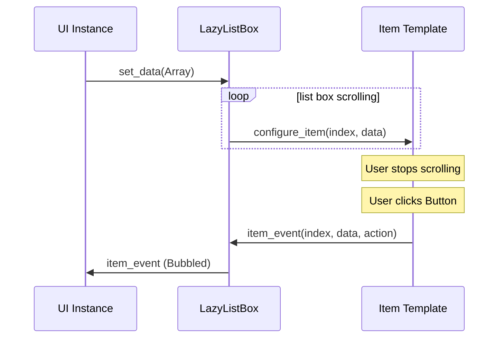

# LazyListBox for Godot 4.5+

A high-performance List-Box control that can handle
thousands of items by recycling a small pool of UI
elements and only displaying what's currently visible
on screen instead of creating individual controls for
every data entry, creating the illusion that you're scrolling
through thousands of actual items. Leave a Star if you will ⭐

https://www.youtube.com/watch?v=DwB_O6uEPPg

## Mnemonic



## Features
- Lazy loading items
- Auto-calculation of visible items (or use a fixed value)
- Synchronized scrollbar
- Focus management with keyboard navigation
- Recycling/Caching items
- Built-in event bubbling via `LazyAction.Emit`, one connection handles the whole list

## Installation
- Download the plugin from the Asset Library or GitHub
- Extract to your project's `addons/` folder

# Usage

## Step 1: Create the LazyListBox
- Open your "Main Scene" and create a `CanvasLayer`, then drop the `lazy_list_box.tscn` into it.
- You will see a `LazyListBox` control.

## Step 2: Prepare your Item Template
Create an `item_template.tscn`. The root node can be any `Control`, but a `Button` is recommended so focus calls work properly out of the box.

For this example the structure looks like this:
```
ItemTemplate (Button-Type)
└── Button (Button-Type)
```

Make sure the `ItemTemplate` root node has:
- The `Flat` property set to `true` in the inspector (if you want to keep the inner Button's look).
- A minimum size that is not `0` (Layout -> Custom Minimum Size -> `Y > 0`). For this example, use `Y = 50`.

Now attach the following script (`my_item_template.gd`) to the **root** of `item_template.tscn`. **It must extend `LazyListItem`**, which is the abstract base class that guarantees the contract with `LazyListBox`. Because `LazyListItem` is declared with `@abstract`, Godot enforces at compile time that every subclass implements `configure_item`. This catches missing implementations early and keeps templates consistent without any runtime boilerplate:

```gdscript
# my_item_template.gd
extends LazyListItem

@onready var button: Button = $Button

func _ready() -> void:
	assert(button != null, "Assign the inner Button in item_template.tscn for this example.")

	# Emit item_event with a LazyAction.Emit value.
	# LazyListBox listens to this signal and bubbles it up automatically
	# so the outside world never needs to know about individual item instances.
	button.pressed.connect(func() -> void:
		item_event.emit(item_index, item_data, LazyAction.Emit.ITEM_SELECTED)
	)

	# Right-click: emit a different action value so consumers can distinguish actions.
	button.gui_input.connect(func(event: InputEvent) -> void:
		if event is InputEventMouseButton and event.pressed:
			if event.button_index == MOUSE_BUTTON_RIGHT:
				item_event.emit(item_index, item_data, LazyAction.Emit.RIGHT_CLICK)
	)


# Called by LazyListBox each time this pooled item is (re-)assigned to a data entry.
# Keep this fast, it runs for every visible item on every scroll step.
func configure_item(index: int, data: Variant) -> void:
	item_index = index
	item_data = data
	button.text = str(data)
```

> [!NOTE]
> `item_index`, `item_data` and the `item_event` signal are inherited from `LazyListItem`.
> Do **not** redeclare them in your script.

## Step 3: Assign your Item Template to the LazyListBox
- Open your "Main Scene" and select the `LazyListBox` node.
- In the Inspector there is a field called `Item Template`.
- Drop your `item_template.tscn` into that `<empty>` field.

## Step 4: Set Data and Handle Events
Create a `Node` somewhere in your scene and attach the following script. It feeds the list with 500 entries and listens for item events:

```gdscript
extends Node

@export var lazy_list: LazyListBox

func _ready() -> void:
	assert(lazy_list != null, "Assign the lazy_list control (the lazy_list_box.tscn you dropped in your scene).")

	# Build some test data
	var test_data: Array = []
	for i: int in range(500):
		test_data.append("Item " + str(i))
	lazy_list.set_data(test_data)

	# ONE connection for the entire list, no matter how many items exist.
	# Signals are wired only to the small pool of visible items, not to all 500 data entries.
	lazy_list.item_event.connect(_on_item_event)


func _on_item_event(index: int, data: Variant, action: LazyAction.Emit) -> void:
	if action == LazyAction.Emit.ITEM_SELECTED:
		print("Selected: ", index, " | data: ", data)
	elif action == LazyAction.Emit.RIGHT_CLICK:
		print("Right-click: ", index, " | data: ", data)
```

That's it, no manual cleanup, no per-item signal wiring, no `item_created` callback. When the pool is cleared (e.g. on template change), the freed nodes take their connections with them.

# Advanced Topics

## Custom Actions
`LazyAction.Emit` already covers the most common interactions. If you need something not in the enum, add your own value directly to it:

```gdscript
# In lazy_action.gd, extend the Emit enum:
enum Emit {
	# ... existing values ...
	MY_CUSTOM_ACTION,
}
```

Then emit it from your template:
```gdscript
item_event.emit(item_index, item_data, LazyAction.Emit.MY_CUSTOM_ACTION)
```

And handle it in your listener:
```gdscript
func _on_item_event(index: int, data: Variant, action: LazyAction.Emit) -> void:
	if action == LazyAction.Emit.MY_CUSTOM_ACTION:
		print("Custom action on: ", data)
```

# Public API Methods

### Basic Operations
- `set_data(data_array: Array)`, Set the data and refresh array size changes.
- `refresh()`, Re-runs `configure_item` for visible items without scrolling. Use this when an existing data object changes (e.g. an inventory amount) and you want the UI to reflect it.
> [!IMPORTANT]
> `refresh()` only works for modifying existing data objects, not for adding/removing items from the array, use `set_data()` for array size changes.
- `scroll_to_index(index: int)`, Scroll to a specific data index.
- `scroll_to_end()`, Scroll to the end of the list.

### Focus Management
- `focus_item_at_data_index(index: int)`, Focus item at data index.
- `set_focus_preservation(enabled: bool)`, Enable/disable focus preservation.
- `get_virtual_focused_index() -> int`, Get currently focused data index.
- `is_list_focused() -> bool`, Check if the list has focus.
- `grab_initial_focus()`, Focus the first available or currently scrolled-to/visible item.

### Configuration
- `set_auto_calculate_visible_count(enabled: bool)`, Toggle auto-calculation.
- `set_manual_item_height(height: float)`, Set manual item height.
- `get_visible_range() -> Vector2i`, Get range of visible indices.

### Signals
- `item_event(index: int, data: Variant, action: LazyAction.Emit)`, Bubbled up from any item template that emits its own `item_event`. Connect once, dispatch by `action` value.
- `item_created(item: Control)`, Emitted whenever the pool instantiates a new item. Useful for low-level integrations that need a hook into freshly created pool nodes.
- `fully_ready`, Emitted when the LazyListBox finished its async initialization.

## Requirements
- Godot 4.5+, required for the `@abstract` keyword used in `LazyListItem`. Abstract classes let Godot enforce at compile time that every item template implements `configure_item`, which eliminates an entire category of runtime errors.
- Your item template must:
  - Extend `LazyListItem`
  - Implement `configure_item(index: int, data: Variant) -> void`

## Troubleshooting

**Problem**: Items appear too small or overlapping
- **Solution**: Set Custom Minimum Size Y > 0 in your item template's root node. A lower `Y` value results in more displayed items.

**Problem**: Focus not working
- **Solution**: Use a `Button` as the root layout element. Enable `Flat` if you want to nest your own layout inside.

**Problem**: I see no items
- **Solution**: You probably forgot to call `set_data(...)`, see Step 4. If data is set but still nothing shows, it's likely a layout issue: re-check Step 2 (custom minimum size).

**Problem**: `item_event` never fires
- **Solution**: Make sure your template script extends `LazyListItem` (not just `Button` or `Control`) and that you emit `item_event` from inside it. `LazyListBox` only bubbles events that originate from `LazyListItem` nodes in its pool.
